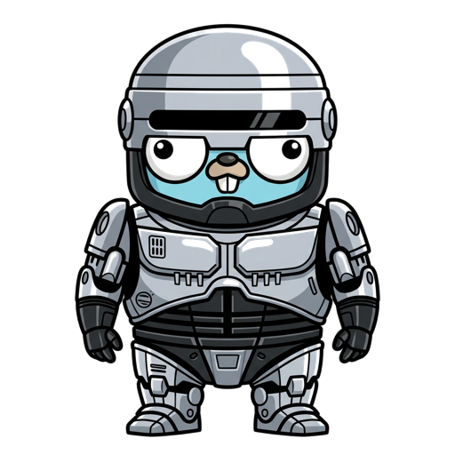
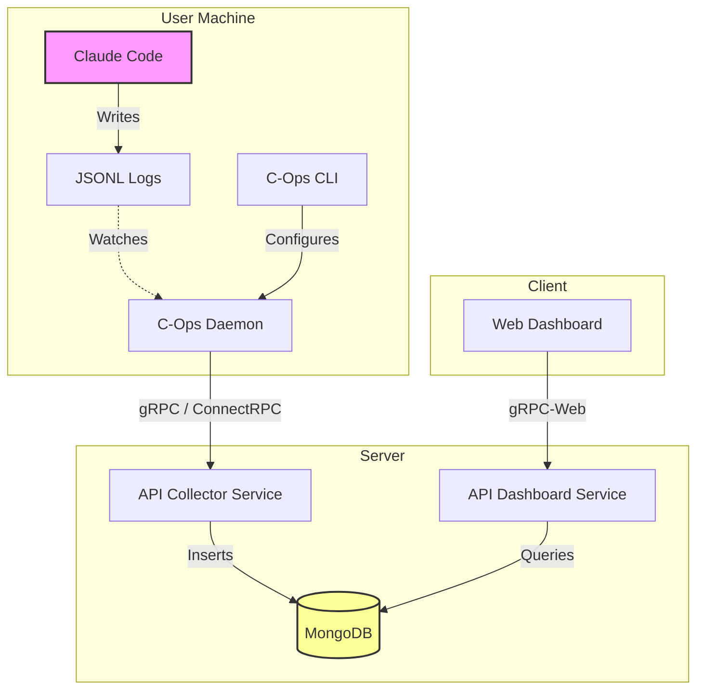

<p align="center">
  
</p>

# C-Ops (Claude Code Ops)

C-Ops is a distributed observability system for tracking, analyzing, and visualizing **Claude Code** sessions across multiple repositories. It provides developers and teams with insights into AI coding assistant usage, token consumption, and agent workflows.

## Architecture

The system consists of four main components:

### 1. CLI (`cli/`)
User-facing command-line tool for managing projects to observe.
- **Role**: Registration and management
- **Status**: Implemented
- **Stack**: Go, Cobra, Dig

### 2. Daemon (`daemon/`)
Background service running on developer machines.
- **Role**: Watches `~/.claude` and project directories, parses real-time JSONL logs, and sends structured data to the Collector.
- **Status**: Implemented (log processor, config watcher)
- **Stack**: Go, Fsnotify

### 3. API Server (`api/`)
Central backend for data collection and dashboard queries.
- **Role**:
    - **Collector**: Receives log streams from daemons via gRPC (ConnectRPC).
    - **Dashboard API**: Serves aggregated data to the web UI.
- **Status**: Collector implemented, Dashboard service pending
- **Stack**: Go, Fiber (HTTP), ConnectRPC (gRPC), MongoDB

### 4. Web Dashboard (`web/`)
Modern React application for visualizing session data.
- **Role**: View projects, session details, chat history, and token usage statistics.
- **Status**: Frontend implemented, API integration pending
- **Stack**: React, Vite, TailwindCSS, TanStack (Query/Router), shadcn/ui

## Data Flow



## Getting Started

### Installation

```bash
curl -fsSL https://raw.githubusercontent.com/team-attention/cops/main/script/install.sh | bash
```

### Supported Platforms
- macOS (Intel & Apple Silicon)
- Linux (x86_64 & ARM64)

### Prerequisites (Development)
- Go 1.25+
- Node.js 20+
- Docker (for MongoDB)

### Local Development

```bash
# 1. Start infrastructure (MongoDB)
cd api
make dev-up

# 2. Run API server
make dev

# 3. Run daemon (in a new terminal)
cd ../daemon
make dev

# 4. Run web dashboard (in a new terminal)
cd ../web
npm install
npm run dev
```

## Project Structure and Documentation

Detailed documentation for each component is available in the `docs/` directory.

- **[Quick Start](docs/docs/getting-started/quick-start.md)**: Installation and first-use guide
- **[CLI Reference](docs/docs/getting-started/cli-reference.md)**: `cops` command usage patterns
- **[Daemon Guide](docs/docs/architecture/daemon.md)**: Background service role and operation
- **[API Server Guide](docs/docs/architecture/api.md)**: Data collection and dashboard API structure

```
cops/
├── api/          # Backend API (Collector + Dashboard service)
├── cli/          # CLI tool (cops)
├── daemon/       # Log watching daemon
├── web/          # Frontend dashboard
├── shared/       # Shared Go libraries and Protobuf definitions
├── idl/          # Proto files
└── docs/         # Documentation
```

## License
[MIT](LICENSE)
