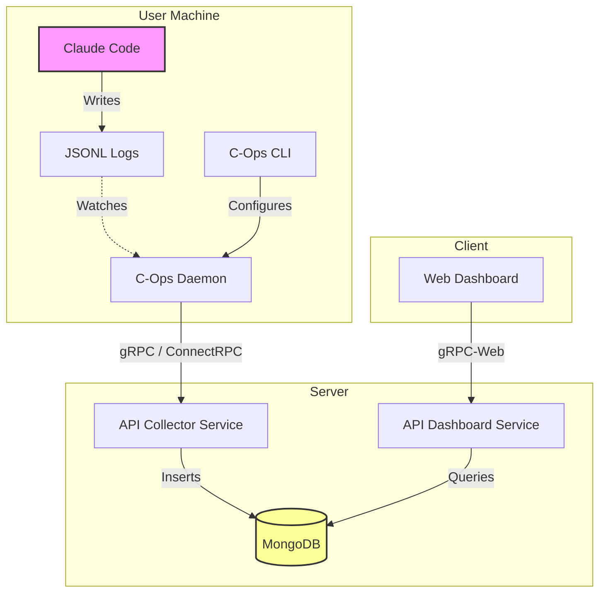

# C-Ops (Claude Code Ops)

C-Ops는 여러 저장소에 걸친 **Claude Code** 세션을 추적, 분석 및 시각화하기 위한 분산 관측 시스템입니다. 개발자와 팀에게 AI 코딩 어시스턴트 사용량, 토큰 소비 및 에이전트 워크플로우에 대한 통찰력을 제공합니다.

## 🏗 아키텍처

시스템은 네 가지 주요 구성 요소로 이루어져 있습니다:

### 1. CLI (`cli/`)
관찰할 프로젝트를 관리하기 위한 사용자용 명령줄 도구입니다.
- **역할**: 등록 및 관리
- **상태**: ✅ 구현됨
- **스택**: Go, Cobra, Dig

### 2. 데몬 (`daemon/`)
개발자 머신에서 실행되는 백그라운드 서비스입니다.
- **역할**: `~/.claude` 및 프로젝트 디렉토리를 감시하고, 실시간 JSONL 로그를 파싱하여 수집기(Collector)로 구조화된 데이터를 전송합니다.
- **상태**: ✅ 구현됨 (로그 프로세서, 설정 감시자)
- **스택**: Go, Fsnotify

### 3. API 서버 (`api/`)
데이터 수집 및 대시보드 쿼리를 위한 중앙 백엔드입니다.
- **역할**:
    - **수집기 (Collector)**: gRPC (ConnectRPC)를 통해 데몬으로부터 로그 스트림을 수신합니다.
    - **대시보드 API**: 웹 UI에 집계된 데이터를 제공합니다 (🚧 진행 중).
- **상태**: ✅ 수집기 구현됨, 🚧 대시보드 서비스 대기 중 (TA-102 예정)
- **스택**: Go, Fiber (HTTP), ConnectRPC (gRPC), MongoDB

### 4. 웹 대시보드 (`web/`)
세션 데이터를 시각화하기 위한 모던 React 애플리케이션입니다.
- **역할**: 프로젝트 보기, 세션 상세 정보, 채팅 기록 및 토큰 사용량 통계 조회.
- **상태**: 🚧 프론트엔드 구현됨, API 연동 대기 중
- **스택**: React, Vite, TailwindCSS, TanStack (Query/Router), shadcn/ui

## 📊 데이터 흐름 (Data Flow)



## 🚀 시작하기

### 설치

```bash
curl -fsSL https://raw.githubusercontent.com/team-attention/cops/main/script/install.sh | bash
```

### 지원 플랫폼
- macOS (Intel & Apple Silicon)
- Linux (x86_64 & ARM64)

### 필수 조건 (개발용)
- Go 1.25+
- Node.js 20+
- Docker (MongoDB용)

### 로컬 실행

```bash
# 1. 인프라 시작 (MongoDB)
cd api
make dev-up

# 2. API 서버 실행
make dev

# 3. 데몬 실행 (새 터미널에서)
cd ../daemon
make dev

# 4. 웹 대시보드 실행 (새 터미널에서)
cd ../web
npm install
npm run dev
```

## 📂 프로젝트 구조 및 문서

각 컴포넌트에 대한 자세한 문서는 `doc/` 디렉토리에 있습니다.

- **[시작하기 (Get Started)](doc/get-started.md)**: 설치 및 첫 사용 가이드
- **[CLI 가이드](doc/cli.md)**: `cops` 명령어 사용법 패턴
- **[Daemon 가이드](doc/daemon.md)**: 백그라운드 서비스의 역할과 동작 원리
- **[API 서버 가이드](doc/api.md)**: 데이터 수집 및 대시보드 API 구조

```
cops/
├── api/          # 백엔드 API (수집기 + 대시보드 서비스)
├── cli/          # CLI 도구 (cops)
├── daemon/       # 로그 감시 데몬
├── web/          # 프론트엔드 대시보드
├── shared/       # 공유 Go 라이브러리 및 Protobuf 정의
├── idl/          # Proto 파일
└── doc/          # 문서
```

## 📜 라이선스
Internal
